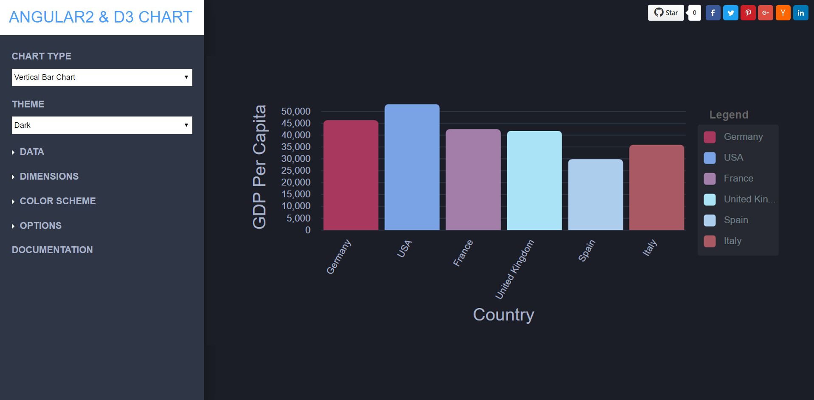
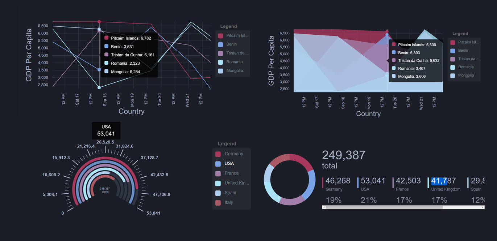

# Angualr2 & D3.js Charts

Declarative Charting Framework for Angular2 and beyond!

Angular2 & D3.js Charts is unique because we don't merely wrap d3, nor any other chart engine for that matter. It is using Angular to render and animate the SVG elements with all of its binding and speed goodness, and uses d3 for the excellent math functions, scales, axis and shape generators, etc. By having Angular do all of the rendering it opens us up to endless possibilities the Angular platform provides such as AoT, Universal, etc. 

Data visualization is a science but that doesn't mean it has to be ugly. One of the big efforts we've made while creating this project is to make the charts aesthetically pleasing. The styles are also completely customizable through CSS, so you can override them as you please.

Also, constructing custom charts is possible by leveraging the various ngx-charts components that are exposed through the ngx-charts module.


## Basic Usage

- Bar Charts



- Other Charts




## Features
### Chart Types
- Horizontal & Vertical Bar Charts (Standard, Grouped, Stacked, Normalized)
- Line 
- Area (Standard, Stacked, Normalized)
- Pie (Explodable, Grid, Custom legends)
- Donut
- Gauge
- Force Directed Graph
- Heatmap
- Treemap
- Number Cards

### Customization
- Autoscaling
- Timeline Filtering
- Line Interpolation
- Configurable Axis Labels
- Legends (Labels & Gradient)
- Advanced Label Positioning
- Real-time data support
- Advanced Tooltips
- Data point Event Handlers
- Works with ngUpgrade

## Install
To use ngx-charts in your project install it via [npm](https://www.npmjs.com/package/@swimlane/ngx-charts):

```
npm i @swimlane/ngx-charts --save
```

## Developing

If you want to run the demos locally, just do:

```
npm install
```

```
npm start
```

Browse to http://localhost:4010

## Credits
`Angular2 & D3 Charts` is a [Swimlane](http://swimlane.com) open-source project; we believe in giving back to the open-source community by sharing some of the projects we build for our application. Swimlane is an automated cyber security operations and incident response platform that enables cyber security teams to leverage threat intelligence, speed up incident response and automate security operations.


